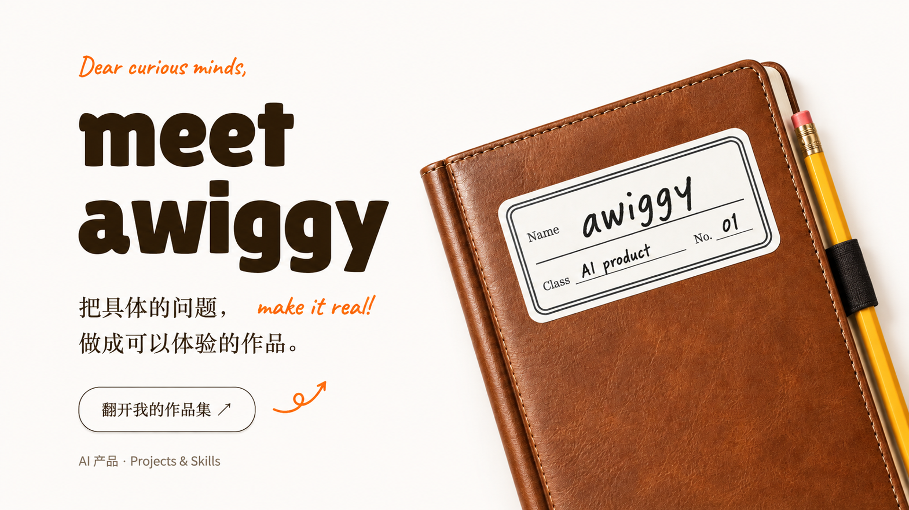

# Hi, I'm awiggy 👋

我是张宛瑜，一名关注 **Agent 工作流、RAG 知识库与 AI 评测**的 AI 产品经理。

从数据分析走向 AI 产品，我习惯先理解业务中的具体问题，再判断哪些环节适合交给 AI、哪些需要规则和人工确认。除了需求拆解与方案设计，我也使用 AI 编程工具，把想法做成可以操作、验证和继续迭代的原型。

这里展示我的产品实践与可复用 Skills：既记录实现了什么，也说明哪些部分仍在验证。

[精选作品](#featured-projects) · [AI Skills](#ai-skills) · [工作方式](#how-i-work) · [全部公开仓库](https://github.com/awiggy?tab=repositories)

## ⭐ Featured projects · 精选作品

三个不同场景的实践：业务流程设计、复杂工具的交互引导，以及可持续扩展的在线内容平台。

### 🧾 [轻报 Qingbao · AI 辅助报销流程 MVP](https://github.com/awiggy/qingbao-expense-mvp)

围绕员工、审批人与财务三种演示角色，串联票据上传、费用核对、报销提交、审批退回与模拟结算。重点关注异常如何处理、状态如何流转，以及每一步是否可追溯。

结合可选的 macOS 本机 OCR、规则校验与模型接口，探索 AI 在信息整理中的辅助作用，保留人工校对与确认。

**当前状态：** 可本地运行的 MVP，使用演示角色与模拟结算；真实模型服务的连通性与效果仍待验证。

`业务流程` `React / TypeScript` `Express / SQLite`

[查看项目与截图](https://github.com/awiggy/qingbao-expense-mvp#产品预览) · [本地使用指南](https://github.com/awiggy/qingbao-expense-mvp/blob/main/docs/LOCAL_GUIDE.zh-CN.md)

### 🔧 [Git Agent Clear · 引导式桌面 Git 客户端](https://github.com/awiggy/git-clear-desktop)

把提交、远程同步、版本历史与冲突处理组织成清晰的任务页面。围绕“接下来做什么、会影响什么、能否撤回”提供操作说明，降低理解 Git 的门槛。

提供可选 AI 合并建议，由用户检查确认；普通 Git 操作无需模型密钥。

**当前状态：** 已提供 macOS、Windows 与 Linux 安装包；真实账号、AI 请求与应用内升级等场景仍有待验收项。

`交互引导` `Rust / egui` `桌面应用`

[下载安装包](https://github.com/awiggy/git-clear-desktop/releases/latest)

### 🎮 [游戏大全 GAME HUB · 在线小游戏合集](https://github.com/awiggy/game-hub)

以分类浏览、游戏详情与嵌入式试玩连接发现和体验，收录 50 款小游戏，覆盖 10 个分类。

通过统一的游戏元数据、自动注册与构建前检查管理新增内容。部分游戏基于开源项目改编，来源与适配说明记录在项目仓库中。

**当前状态：** 小游戏平台可在线体验；AI 创作入口为交互演示，尚未接入生成后端。

`内容组织` `Vue 3 / Vite` `自动化构建`

[在线试玩](https://awiggy.github.io/game-hub/)

## 🧩 AI Skills · 可复用的 AI 工作流

围绕产品分析、开发交付与中文写作，把常用方法整理成可按需调用的技能。下面是三个精选入口；使用方式与适用边界见各仓库。

### 🛠️ [AI Product Delivery Skills · AI 产品交付工具箱](https://github.com/awiggy/agent-product-delivery-skills)

四个独立 Skill，覆盖 Agent 架构规划、业务功能实现、前端交互与发布检查。按阶段使用，明确验收要求与操作边界。

适合从想法或 PRD 推进到可验收的功能。当前为初版，不是应用脚手架或一键上线工具。

### 🔍 [Reverse AI Product · AI 产品拆解](https://github.com/awiggy/reverse-ai-product)

从截图、录屏与交互证据梳理用户流程、Agent 分工和工具调用，区分已知事实与架构推断，形成可追溯的分析报告。

### ✍️ [Human Writing · 中文写作共创](https://github.com/awiggy/human-writing)

从一个模糊想法开始，通过观点讨论、材料研究与结构梳理推进写作，也支持已有文章的修改和表达优化。

[查看全部 Skills →](https://github.com/awiggy/ai-skills)

## How I work · 我的工作方式

- **先明确问题**：梳理用户、任务与业务约束，再决定是否需要 AI，以及 AI 应承担哪一部分。
- **用原型验证方案**：将流程、页面与接口连起来，覆盖正常路径，也关注退回、失败、重试与恢复。
- **区分演示和验证**：固定示例不等于真实模型效果，测试通过不等于所有使用场景都已验收。
- **保留人的判断**：涉及提交、审批、冲突处理或发布的关键操作，明确影响范围与确认节点。
- **沉淀可复用方法**：把任务步骤、验收要求与操作边界整理进 Skills，减少重复摸索。

项目中使用的技术包括 React / TypeScript、Vue、Node.js / Express、SQLite、Rust / egui 与 Python；根据任务选择工具，通过 AI 辅助开发推进实现与验证。

欢迎通过对应项目的 Issues 交流使用问题与改进建议。

**从具体问题出发，用可体验的作品检验想法。**
